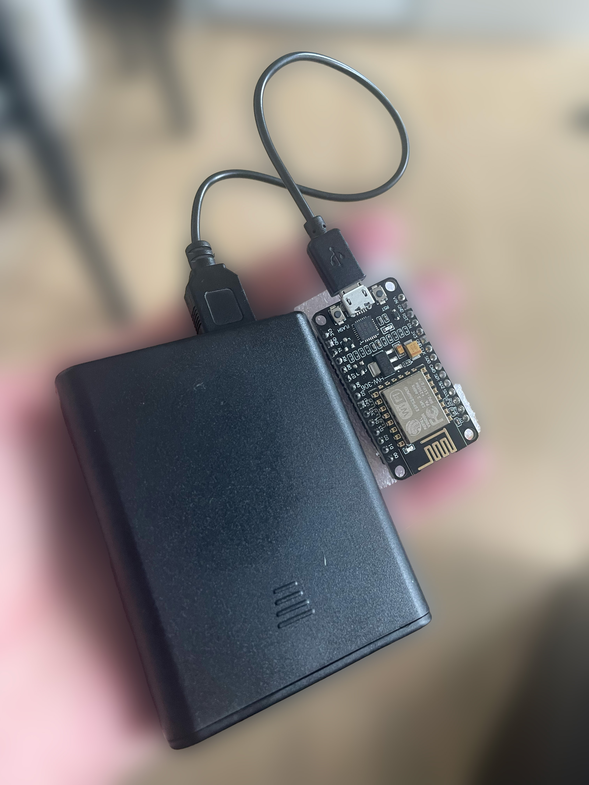
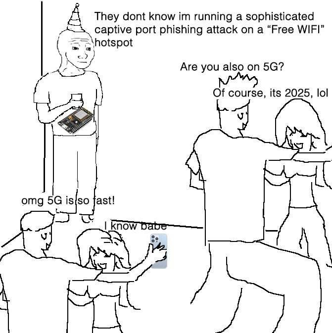

# 🎯 Evil Twin Captive Portal Simulator (ESP8266)

> Et sideprojekt i cybersikkerhed, der simulerer et realistisk Captive portal phishing-angreb – uden permanent datalagring.

---

## 📡 Hvad gør projektet?

Dette projekt opsætter et **falsk WiFi-hotspot ("CPH - FREE WiFi")** via en ESP8266 og fanger alle WIFI-anmodninger, og promter en Captive portal. Brugeren bliver automatisk videresendt til en **Google-lignende login-side**, hvor indtastede oplysninger bliver:

✅ **Vist live** på en admin-side (`/log`)  
❌ **Ikke gemt permanent**  
⚠️ **Kun midlertidigt lagret i RAM**

Dette er en **sikker, lokal simulation** – ideel til **undervisning, demonstrationer og cybersikkerhedsforståelse**.

---

## 🔐 Funktioner

- 🔥 Fake WiFi AP med valgfrit SSID (`CPH - FREE WiFi`)
- 🌐 Fanger nye forbindelser til WIFI og sender til captive portal
- 🎭 Login-side der simulerer Googles UI (med 2 trin)
- ⏱ Live-log af credentials (brugernavn + adgangskode) vises på `/log`
- 🧠 Admin-side med adgangskodebeskyttelse (`?pass=123`)
- ⚠️ Logs slettes ved genstart – intet gemmes
- 🎨 Fuldt stylet frontend med system defineret mørk/lys tema
- 💻 HTML/CSS medfølger IKKE - Dette er en rapport, og ikke en intro til koden.

---

## 📸 billeder

---

## 🛠️ Kom i gang

### Hardware
- ESP8266 (f.eks. NodeMCU, Wemos D1 Mini)
- miniUSB-kabel og strøm (vigtigt, sørg for det er et datakabel, og ikke et strømkabel)
- (Valgfrit) Powerbank for mobil demonstration

### Software
- Arduino IDE + ESP8266 Board Manager
- Biblioteker: `ESP8266WiFi.h`, `ESP8266WebServer.h`, `DNSServer.h`

---

## ⚠️ Etiske overvejelser

Dette projekt er **udelukkende til uddannelsesbrug**. Brug informationen ansvarligt og **aldrig på offentlige steder** eller uden samtykke.

**Formålet er at lære:**
- Hvordan WiFi-sikkerhed kan udnyttes
- Hvor let det er at narre brugere med social engineering
- Hvordan man som bruger kan beskytte sig

---

## 👀 Realistisk scenarie af deployment

