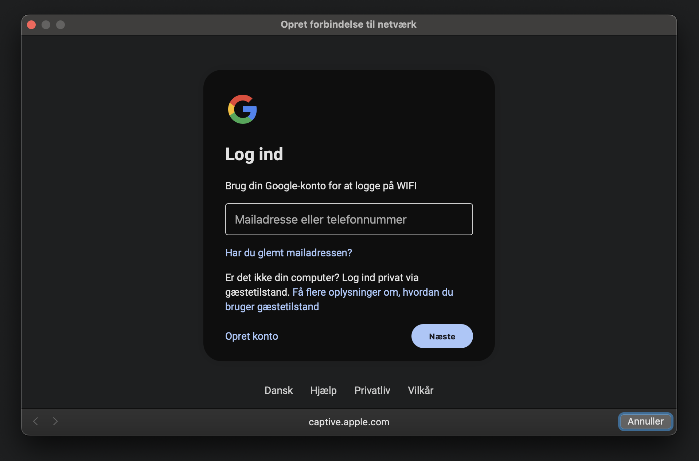
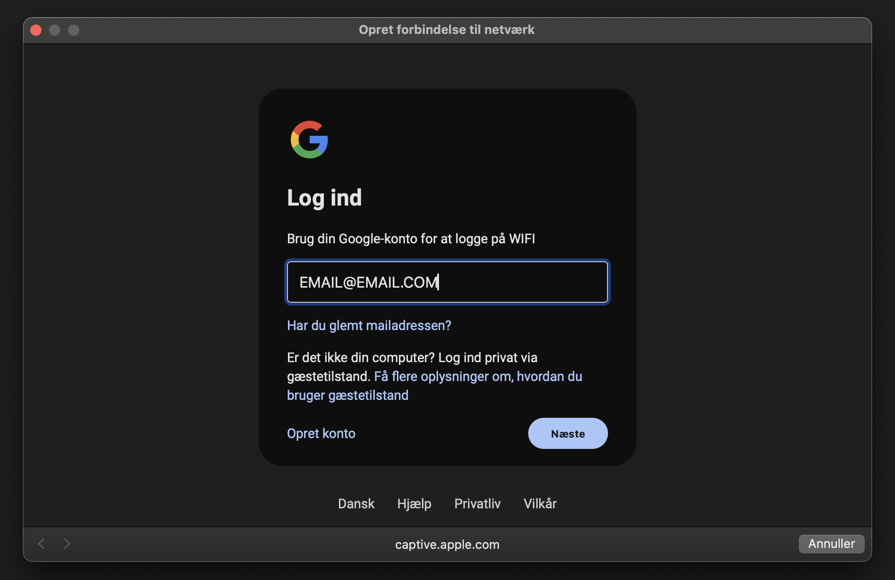
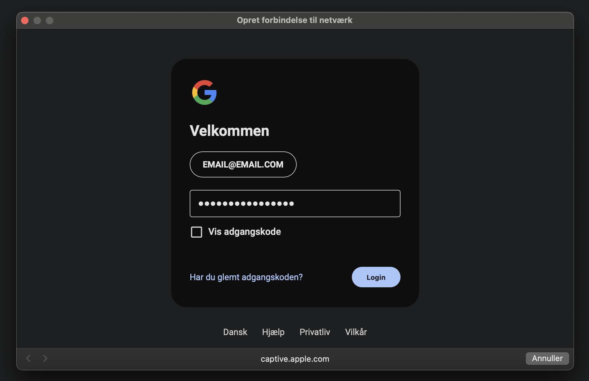
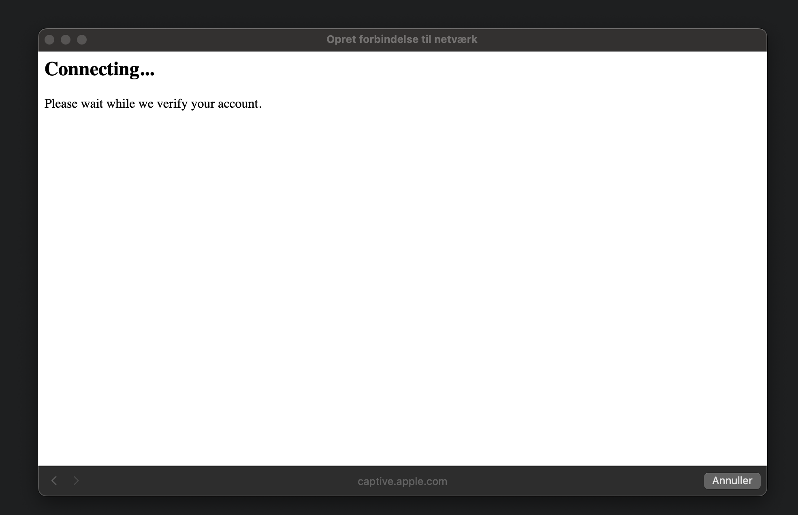

# 🎯 Evil Twin Captive Portal Simulator (ESP8266)

> Et sideprojekt i cybersikkerhed, der simulerer et realistisk Captive portal phishing-angreb – uden permanent datalagring.

---

## 📡 Hvad gør projektet?

Dette projekt opsætter et **falsk WiFi-hotspot ("CPH - FREE WiFi")** via en ESP8266 og fanger alle WIFI-anmodninger, og promter en Captive portal. Brugeren bliver automatisk videresendt til en **Google-lignende login-side**, hvor indtastede oplysninger bliver:

✅ **Vist live** på en admin-side (`/log`)  
❌ **Ikke gemt permanent**  
⚠️ **Kun midlertidigt lagret i RAM**

Dette er en **sikker, lokal simulation** – ideel til **undervisning, demonstrationer og cybersikkerhedsforståelse**.

---

## 🔐 Funktioner

- 🔥 Fake WiFi AP med valgfrit SSID (`CPH - FREE WiFi`)
- 🌐 Fanger nye forbindelser til WIFI og sender til captive portal
- 🎭 Login-side der simulerer Googles UI (med 2 trin)
- ⏱ Live-log af credentials (brugernavn + adgangskode) vises på `/log`
- 🧠 Admin-side med adgangskodebeskyttelse (`?pass=123`)
- ⚠️ Logs slettes ved genstart – intet gemmes
- 🎨 Fuldt stylet frontend med mørk/lys tema + ASCII animation
- 💻 HTML/CSS medfølger – let at tilpasse

---

## 📸 billeder

| 🔍 Hvad | 📷 Billed-idé |
|--------|----------------|
| 1. Login-side | Screenshot af fake Google login (step 1 og 2) |
| 2. Admin log | Screenshot af log-tabel med credentials |
| 3. ESP8266 setup | Foto af din ESP8266 koblet til strøm |
| 4. Terminal | Billede af seriemonitor der viser aktivitet |
| 5. Netværkssøgning | Screenshot fra mobilen hvor SSID vises |
| 6. ASCII terminal | Screenshot af `/log` side med animation og grøn terminal |

👉 Brug evt. GitHub’s drag-and-drop funktion til at uploade dem eller placér dem i en `docs/` mappe og link med relativ sti.

---

## 🛠️ Kom i gang

### Hardware
- ESP8266 (f.eks. NodeMCU, Wemos D1 Mini)
- miniUSB-kabel og strøm (vigtigt, sørg for det er et datakabel, og ikke et strømkabel)
- (Valgfrit) Powerbank for mobil demonstration

### Software
- Arduino IDE + ESP8266 Board Manager
- Biblioteker: `ESP8266WiFi.h`, `ESP8266WebServer.h`, `DNSServer.h`

### Installation
1. Clone dette repo
2. Åbn `.ino` filen i Arduino IDE
3. Upload til din ESP8266
4. Tilslut til det nye WiFi: `CPH - FREE WiFi`
5. Vent på Captive Portal popper op
6. Skriv en email, fx`EMAIL@SUPEREMAIL.com`
7. Skriv et password **VIGTIGT!! - skriv aldlrig dit rigtige password**
8. Tjek din log (192.168.4.1/log?pass=123)

---

## ⚠️ Etiske overvejelser

Dette projekt er **udelukkende til uddannelsesbrug**. Brug det ansvarligt og **aldrig på offentlige steder** eller uden samtykke.

**Formålet er at lære:**
- Hvordan WiFi-sikkerhed kan udnyttes
- Hvor let det er at narre brugere med social engineering
- Hvordan man som bruger kan beskytte sig

---

## 👀 Demo

> (Indsæt GIF'er eller billeder her)
